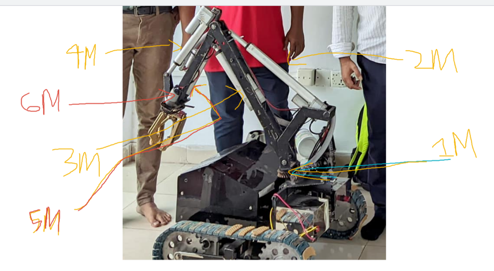

1) ***In horizontal circular rotation right function, the Rpwm1M variable lets the arm move in the right direction and in horizontal circular rotation left function, the Lpwm1M variable lets the arm move in the left direction.***
2) ***In front back actuator front function, the Rpwm2M variable lets the arm move in the front and in front back actuator back function, the Lpwm2M variable lets the arm move in the back***
3) ***In up down actuator up function, the Rpwm3M variable lets the arm move in the up and in up down actuator down function, the Lpwm3M variable lets the arm move in the dowm.
In up down actuator up function, the Rpwm3M variable lets the arm move in the up and in up down actuator down function, the Lpwm3M variable lets the arm move in the down***
4) ***In wrist_actuator_down function, the Lpwm4M variable let the wrist part move towards down and in wrist_actuator_up function, the Rpwm4M variable let the wrist part move towards up***
5) ***In claw_Actuator_open function , the Rpwm5M and Rpwm6M variables let the claw part open and in claw_Actuator_close function, the Lpwm5M and Lpwm6M let the claw part close.
This two actuator are connected in parallel so they function together.***
